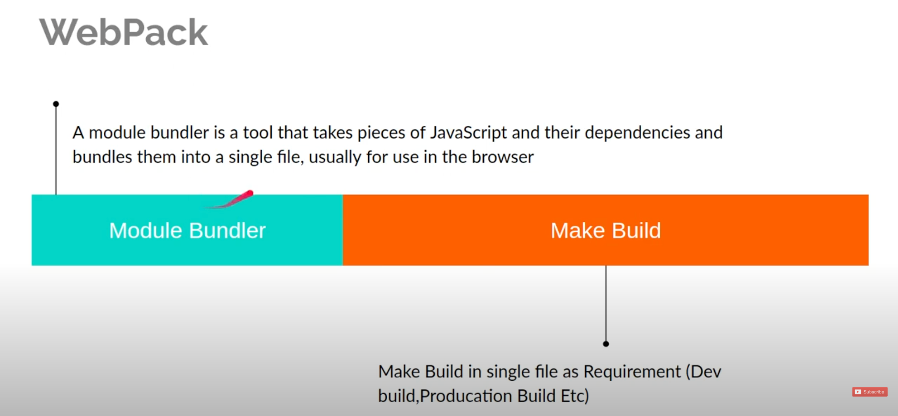
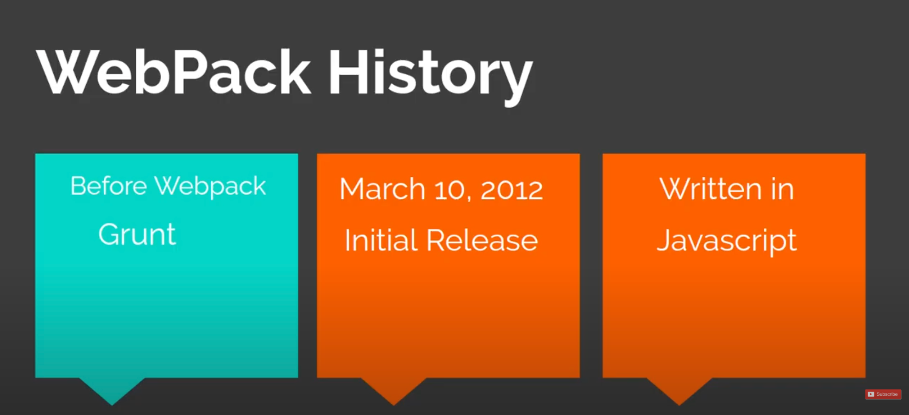
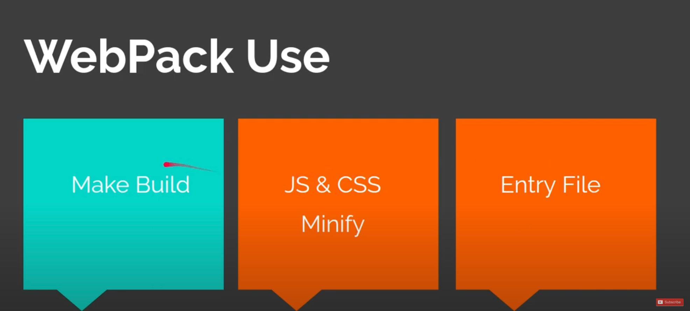

# Introduction

A module bundler is a tool that takes pieces of javascript and their dependencies and bundles them into a single file, usually for use in the browser.

## Webpack History

## Webpack Use

- Make Build
- JS & CSS Minify
- Entry File

